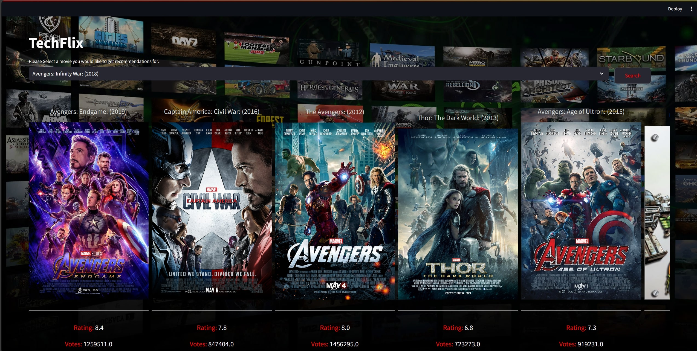

</img>

# Example of project using this Dataset
   1. Clone This repository: [TechFlix](https://github.com/ishanluhani/TechFlix)
   2. Extract pickle file from [simularities.zip](https://drive.google.com/file/d/1idEQcSGudUrl7SUeedP8eYrcQCT-3YaR/view?usp=drive_link) and place it in the same folder as `main.py`
   3. Use This command to run the project: `streamlit run main.py`

# Dataset through which this project was made
   Kaggle link: [Movies Dataset](https://www.kaggle.com/datasets/ishanluhani/indian-and-american-movies-1970-2023)

   You can also extract data by yourself by using the python file in the data collection folder
